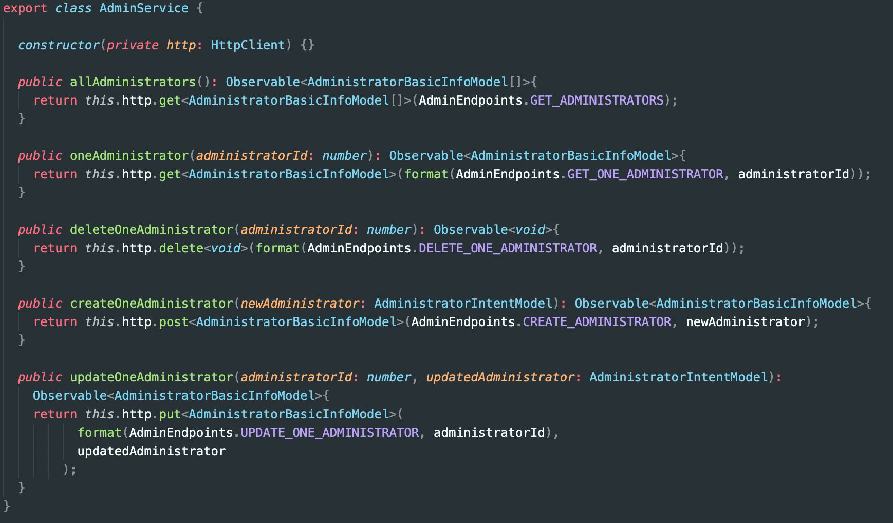
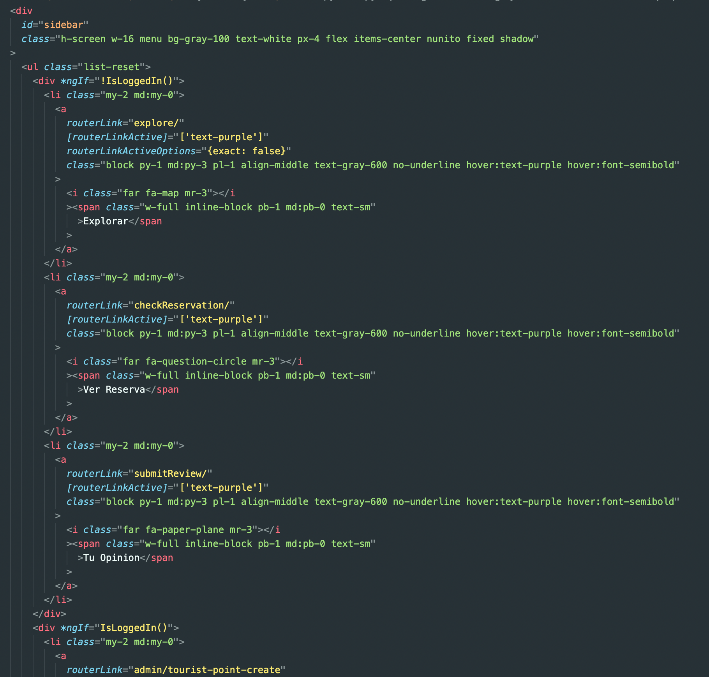

# Análisis Deuda Técnica FE

## Analisis estatico de codigo

### Clean Code

El uso de comentarios generalmente no es recomendado y la mayoria violan los principios de Clean Code.

CC sobre comentarios:

- “_When you feel the need to write a comment, first try to refactor the code so that any comment becomes superfluous.”_

- “_The best comment is a good name for a method or class.”_

Utilizacion comentarios redundantes

---

Otro principio de CC, es que si se va a eliminar codigo, que se borre directamente, no comentarlo, porque despues queda el comentario olvidado:

---

Utilizacion de nombres redundantes para metodos, no hay necesidad de especificar “One” en todas las firmas, se entiende que `deleteAdministraitor` o `createAdministraitor` refiere a un admin. `getAdministrator`, `getCategory` seria más claro que `oneAdministrator` y `oneCategory` respectivamente.

---

Una buena practica seria importar todos los strings que son utlizados cómo constantes a un archivo comun en el proyecto, de la misma manera que se hace en endpoints.ts, el codigo queda más claro, y reduce el costo de cambio

En este metodo, los 3 bloques else if pueden ser suplantados por un unico bloque con un || entre las 3 condiciones, ya que, en los 3 se ejecuta el mismo codigo.

`else if (error.status === 400 || error.status === 409 || error.status === 500){ alert(error.error); handled = true; }`

---

Existen dependencias que no se utilizan, una buena practica seria eliminar todas las dependencias innecesarias

---

Extraer `this.resortSearchModel.acommodationDetails` para no tener que repetirlo tantas veces.

---

Utilizar nombres descriptivos, en este caso puede no quedar claro lo que es `p`

---

## Mejoras

Un aspecto que es de GRAN ayuda para ordenar, organizar y vizualizar el codigo es usar algun formateador de codigo, cómo puede ser `Prettier`. Para dar un poco de perspectiva:

**Sin Prettier:**

El codigo queda fuera de la pantalla horizontalmente y se hace tedioso de leer y entender.

---

**Con Prettier:**

---

Otro aspecto de mejora podria ser separar imports externos/internos con un salto de linea, por ejemplo:

---

Eliminar response que no se utilizan para reducir complejidad.

---

Extraer funciones repetidas a un archivo comun. La funcion showError se puede encotrar repetida en varios archivos

---

En este archivo, podria ser una buena idea ordernar los imports alfabeticamente para mantener el orden y el entendiemiento:

---

## Bugs
