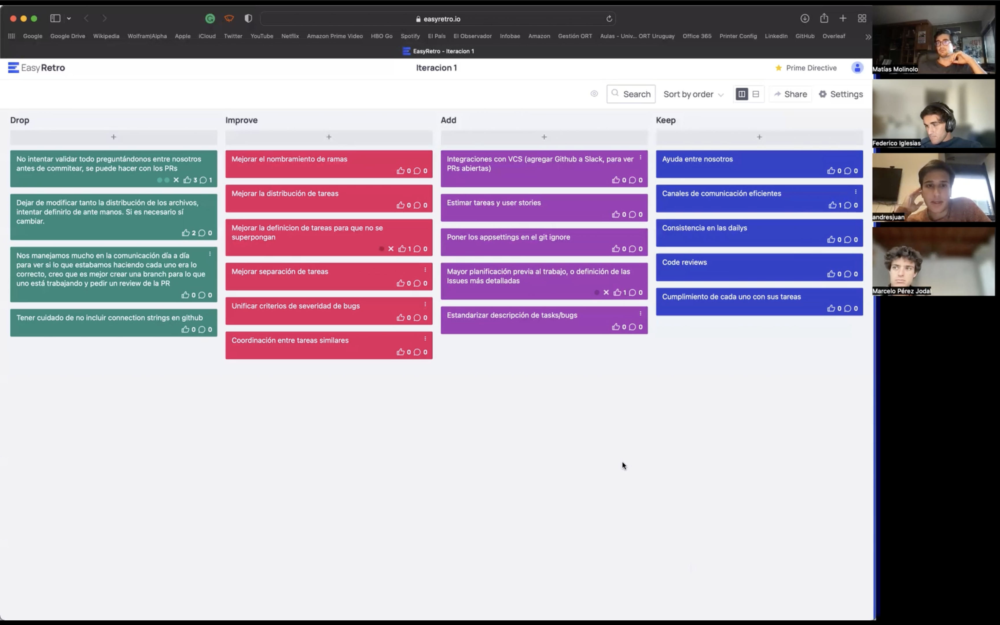

# Documentación Stand-ups diarios

A continuación grabaciones de las primeras tres dailies de esta iteración: 

Stand-up 27-04: https://vimeo.com/707099570

Stand-up 29-04: https://vimeo.com/707099950

Stand-up 04-05: https://vimeo.com/707099996

# Documentación Retrospectiva

Retrospectiva 06-05: https://vimeo.com/707100107

En la retrospectiva, utilizamos la herramienta easyretro.io, en la cual creamos un tablero con cuatro columnas correspondientes a DAKI: Drop, Add, Keep y Improve. Luego, dejamos un tiempo para que cada uno, anónimamente e independiemente, agregue comentarios y observaciones referentes a cada columna. El resultado lo vemos a continuación: 

Una vez que todos terminamos de escribir en las columnas, discutimos cada una de las observaciones agregadas. 
Destacamos algunas de las más importantes:

Drop:
- Dejar de sobrevalidar con el resto del equipo el trabajo realizado y permitir que estas instancias se den en las code reviews en Github. Sin embargo, para esto acordamos que si la cuestión es de suma importancia, es necesario sí relevarla por otros medios de comunicación, dado que en una PR puede pasar desapercibida. Es decir, ninguno de los dos extremos: ni la sobrevalidación, pero tampoco cero validación; la idea es buscar un intermedio.
- Dejar de committear los connection strings de cada uno a github, impactando sobre los de los demás. Para esto, acordamos incluir los appsettings.json (archivos donde se encuentran los connection strings) en el gitignore para evitar esto.

Add:
- A partir de la iteración 2, debemos estimar tareas y user stories, algo que en esta iteración no se hizo por ser la primera.
- Estandarizar la descripción de tasks/bugs.
- Integraciones de Github a Slack, para tener mayor visualización de lo que ocurre en el repositorio.

Keep:
- La ayuda y colaboración entre los integrantes del equipo.
- Comunicación eficiente.
- Consistencia en stand-ups y retrospectivas.
- Code reviews y cumplimiento de tareas.

Improve:
- Mejorar el nombramiento de ramas. 
- Coordinar tareas similares, mejorando su definición para evitar la superposición entre estas. Pasó aquí que, esta iteración, al tener tareas grandes como "Análisis de la deuda técnica del Backend", algunos de los integrantes del equipo se pisaron en sus tareas.

La retrospectiva nos permitió reflexionar sobre nuestra modalidad de trabajo, como puede verse con todo detalle en la grabación. Concluímos que para las próximas iteraciones priorizemos la autonomía en el trabajo, aumentemos la planificación y estandarización, y continuemos con nuestra comunicación y ayuda cuando nos encontramos con problemas o blockers.

A continuación discutimos las métricas correspondientes a las horas de trabajo, pero con la salvedad de que en esta iteración no tuvimos estimaciones. 

El cycle time varió según el tamaño de las tareas: hubo tareas que requirieron 7 HS-P, y otras 1 HS-P. Esto nos hizo pensar que las tareas estuvieron mal distribuidas, debería haber más uniformidad, por lo que deberíamos haber dividido granularmente las tareas más grandes. 

En lo que al WIP refiere, nos propusimos que el WIP sea 4 (1 tarea por persona a la vez). Esto se logró en varios momentos: intentamos que el equipo esté en sync, es decir, estar todos en la misma etapa para poder ayudarnos con dudas. Por ejemplo: el setUp del proyecto; si uno lo hacía 1 semana después, probablemente iba a ser más díficil ayudarlo.

Concluimos que el trabajo estuvo bien distribuido a lo largo de la iteración, un aspecto que nos habíamos propuesto como equipo al empezar el período. No queríamos dejar todo el trabajo para el final. 

El esfuerzo real en HS-P de cada tarea se puede ver en las descripciones de las mismas en Github.

