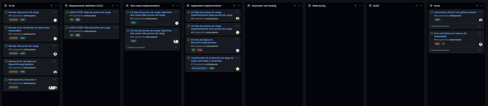
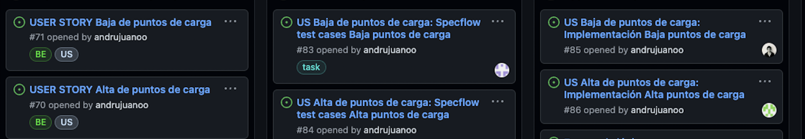
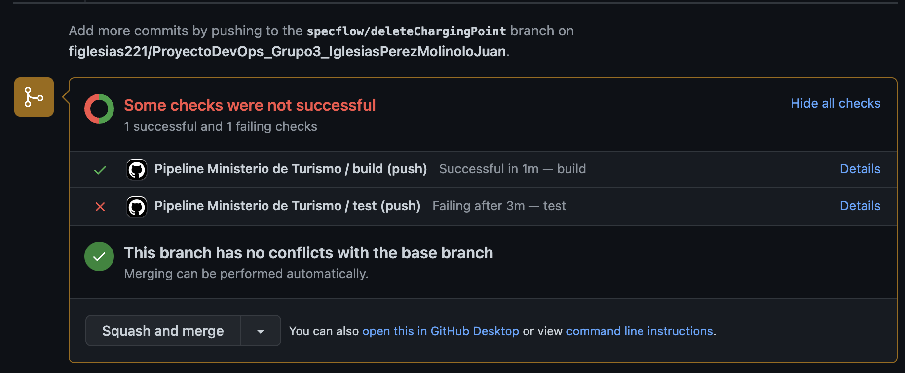

# Iteración 2

## Justificación de la inclusión de los bugs

En base al análisis y bugs identificados en la iteración 1, decidimos reparar los dos siguientes bugs que cosideramos con mayor severidad para el sistema:

- **Issue #60: Error de lógica en ResortPricingCalculator:** 

Este bug comprendía una serie de tres errores de lógica a nivel conceptual y del negocio que consideramos de extrema severidad pues se relacionan directamente con el precio que se calcula y cobra a un cliente por la reserva en un hospedaje. A continuación se listan estos tres errores:
- 1: Cuando se calcula en *CalculateTotalPriceForAccommodation* el precio (con descuento) para una reserva, se hace así: **amountOfNights * guestsWithDiscount * pricePerNight * discount** (la cantidad de noches de la reserva, multiplicado por la cantidad de huéspedes que aplican al descuento, multiplicado por el precio por noche, y multiplicado por el descuento). Esto es **incorrecto** dado que **se está sumando al precio total el descuento y no el precio luego de aplicar el descuento**, que es lo que tiene que pagar el cliente. La forma correcta de hacerlo es multiplicando por (1 - descuento): **amountOfNights * guestsWithDiscount * pricePerNight * (1 - discount)**.
- 2: El segundo error es que, para cada *GuestGroup* (grupo de huéspedes: adulto, niños, bebes, etc) el sistema acumula sus descuentos en vez de tomar el mayor de estos. Este error implica que si hay más de un descuento, se van a sumar los precios con cada descuento, cobrando más. Lo que se debe hacer es tomar el descuento más favorable por grupo de huésped.
- 3: Para calcular la cantidad de noches de cada reserva, se utiliza *Math.Ceiling*: techo entre la cantidad de días que pasaron entre CheckIn y CheckOut. Esto es correcto si el CheckOut es anterior al CheckIn, pero si el CheckOut es posterior al CheckIn entonces va a sumar una noche extra que no es correcta. Por tanto, se debem considerar los dos casos por separado: si CheckIn > CheckOut, o viceversa.

Estos errores llevan a una potencial pérdida de dinero por parte de clientes o de la empresa hotelera, dado que en todos estos casos el sistema les cobra una suma que es errónea: puede ser más alta como en el caso de 2 y 3 o más baja como en el caso de 1.

De forma que priorizmos estos errores, y utilizamos el criterio de reparar este error dado que significa una pérdida financiera potencialmente significativa.

- **Issue #44: Error de fechas en reserva de hospedajes**: 

Decidimos priorizar la reparación de este bug dado que en este encontramos dos errores. 
Por un lado, el sistema modifica las fechas seleccionadas por el usuario al hacer una reserva. Al modificar las fechas de la reserva, evidentemente la funcionalidad es incorrecta y no es confiable para el usuario, quien es partícipe del error. Consideramos que su arreglo es fundamental para la funcionalidad del sistema dado que justamente es un sistema de reserva de hospedajes. Si los usuarios no confían en esta funcionalidad, entonces el sistema no es sostenible en términos de negocio; estará destinado al fracaso.

Por otro lado, otro error en cuanto a fechas es que si se desea reservar para el día de hoy se nos presenta un error incorrecto diciendo que no se pueden hacer reservas para días anterior al actual, cuando se está seleccionando el actual. Consideramos que arreglar esto también es de elevada importancia porque muchos usuarios querrán realizar reservas de forma inmediata, para el día actual.

## Desarrollo/Mantenimiento del nuevo tablero utilizando BDD

Para esta nueva iteración, en la que usamos BDD para desarollar las nuevas funcionalidades, tuvimos que realizar modificaciones al tablero con respecto a la iteración anterior. El resultado se puede ver a continuación:

 
En particular, se eliminaron las columnas:
- In progress
- Blocked
- QA. 

Luego, se crearon nuevas columnas por cada paso en el proceso de BDD, resultando en seis nuevas columnas:
- Requirements definiton (CCC): en esta etapa se tomaba la User Story y se hacía CCC, teniendo como resultado un conjunto de requerimientos en forma de escenarios GHERKIN. 
- Test cases implementation.
- Application implementation.
- Automatic Unit testing
- Refactoring 
- Build.

Luego de que se pasaba por todas estas etapas, se movía la CARD a Done, dado que se entendía que esa funcionalidad/bug había sido terminada.

Vale aclarar que las user stories fueron divididas en tasks, de forma de poder granulizar y dividir mejor el trabajo entre los distintos integrantes del equipo. Si un solo integrante cargaba con toda la user story, entonces iba a ser mucho trabajo en una sola tarjeta, lo cual sería ineficiente e injusto. Por ello, separamos en distintas tasks que podían ser asignadas a distintos integrantes. Para manejar esto teníamos una tarjeta para la User Story global (con su narrativa y escenarios), y luego teníamos tasks que referían a tareas específicas de una determinada user story.

**Ejemplo:**
- Primera columna: tarjeta de la user story global.
- Segunda columna: definir escenarios de test usando SpecFlow, para cada user story.
- Tercera columna: implementación de la funcionalidad, para cada user story.

Veáse que estas tareas se asignan a distintas personas, y la user story de forma global no se asigna a nadie.

 
## Desarrollo/Mantenimiento del pipeline y vínculo con el tablero
 
Para la iteración 2, se creó una pipeline "Pipeline Ministerio de Turismo", a traves de github actions, que con cada push o merge de una rama, la pipeline corre dos *steps*:
- **Build**: un Build de la aplicación automático, informando si el proceso es satisfactorio o no. 
- **Tests**: lo mismo ocurre con los tests. Se corren todos los tests de la solución, y de esta manera nos aseguramos de no introducir tests que no pasan a develop/main.
 
A continuación podemos ver un ejemplo de un PR de una rama hacia develop en la cual el build se realiza con éxito pero los tests no están pasando en su totalidad:
 

 
En cuanto a la relación de la nueva pipeline con el tablero se asocian la columna *Automatic Unit testing* con la corrida automática de los tests y el build automático con la columna de *Build*.

