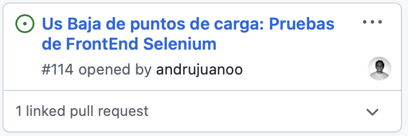
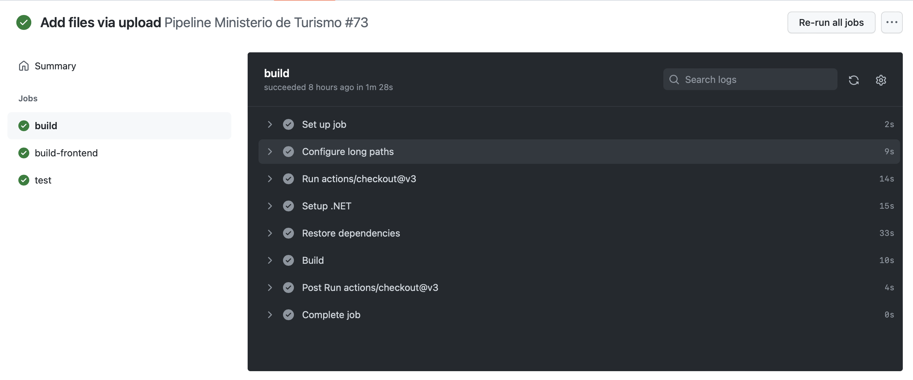

## Guias iteración 3
**Tablero**

En términos de columnas, el tablero se mantuvo como en la iteración anterior, contando con los esfuerzos estimados y reales de cada integrante y por tarea, en cada tarjeta. Las columnas fueron las siguientes: [To Do, Requirements Definition (CCC), Test cases implementation, Application Implementation, Automatic unit testing, Refactoring, Build, Done tasks, Done user stories].

Adicionalmente, integramos los Pull Requests a las tasks del board para mayor unificación del repositorio, y vínculo del código con el tablero. De esta forma, cada vez que alguno quería hacer un *Code Review* o simplemente ver el progreso de alguna tarea, fácilmente podía ir al tablero, elegir la tarea y acceder al progreso de esta en su rama particular.

Se puede ver un ejemplo a continuación (ver *linked pull request*):

**Pipeline**

En esta iteración, configuramos un paso extra en el pipeline: el **BUILD del Front End de Angular**. Tal como fue acordado en clase, no configuramos correr los tests de Selenium del Front End en el pipeline dado que estos apuntan al FrontEnd y BackEnd corriendo, y esto es algo que no podemos imitar en la pipeline.

A continuación vemos un ejemplo de nuestra pipeline, con sus tres etapas: el build del BackEnd, el build del FrontEnd, y los tests automatizados del BackEnd.

