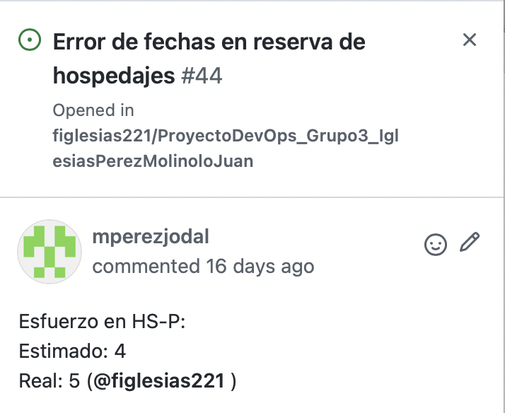

# Documentación Retrospectiva Iteración 2

Retrospectiva 20-05: https://vimeo.com/manage/videos/712198744/

Nuevamente, utilizamos la herramienta easyretro.io, como también se utilizó un tablero DAKI: Drop, Add, Keep y Improve. Luego, ingresamos todas las cards anónimamente, lo cual vemos a continuación:

 
Una vez que todos terminamos de escribir en las columnas, discutimos cada una de las observaciones agregadas.
Destacamos algunas de las más importantes:
 
Drop:
 
- Dejar hacer PRs muy extensas que dificultan las CR y enlentecen el proceso de ingeniería, a su vez, esto va de la mano con dejar de tener branches que tienen un largo tiempo de vida. Se concluyó en una mejor división de tareas para que no ocurra esto nuevamente.
- Tener más comunicación sobre problemas comunes para ayudarnos mutuamente y no perder tiempo que ya perdió otro.
 
Add:
 
- Manejar de una mejor manera las cargas de trabajo dentro de la iteración.
- Investigación de herramientas, incluso antes de verlas en clase, para mantener la iteración más balanceada.
 
Keep:
 
- Definición precisa de tareas
- Buena organización del board
- Buenas estimaciones.
 
Improve:
 
- Documentar en la medida que se toman las decisiones.
- Tracking de cycle y lead time desde el comienzo en la iteración.
- Balancear mejor con otras obligaciones (no dejar todo para el final).
 
En definitiva, se concluyó que fue una iteración buena, en la que pudimos mantener lo bueno y mejorar lo que nos habíamos planteado en la retrospectiva pasada. Nuestro mayor obstáculo fue la dificultad para coordinar el trabajo de la iteración con otras obligaciones (parciales, entregas, etc). Creemos que el ajuste de los puntos mencionados anteriormente, ayudarán al crecimiento continuo del equipo.
 
A continuación discutimos las métricas correspondientes a las horas de trabajo.
 
- El cycle time varió según el tamaño de las tareas: hubo tareas que requirieron 6 HS-P, y otras 1 HS-P. Creemos que el valor más representativo es el máximo cycle time, y creemos que la razón por la cual es alto es porque deberíamos haber dividido más la task (hacerla más granular). Este fue el caso, por ejemplo, de la implementación del alta de puntos de carga. 
En sí, no tuvimos grandes obstáculos o errores inesperados a no ser por algunos errores que fueron rápidamente planteados a nivel de equipo y corregidos con la colaboración de todos.
 
- En lo que al WIP refiere, nos propusimos que el WIP sea 4 (1 tarea por persona a la vez). Esto se logró parcialmente, ya que, en determinado momento, algunos integrantes tenían 2 tareas al paralelo dado que se acercaba el final de la iteración. 
 
A pesar de los buenos resultados, se concluyó que principalmente el trabajo no estuvo bien distribuido dentro de la iteración y es un punto de mejora importante, que se debe mayoritariamente a la carga de otros parciales y trabajos pendientes con los cuales tuvimos que dividir el tiempo a dedicar.
 
El esfuerzo real y estimado en HS-P de cada tarea se puede ver en las descripciones de las mismas en Github. Por ejemplo:

