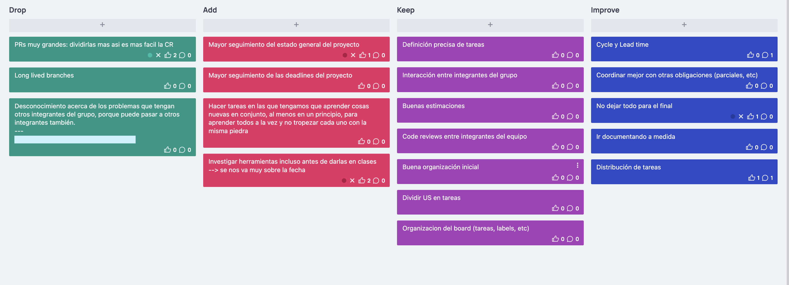

# Documentación Retrospectiva Iteración 2

Retrospectiva 20-05: https://vimeo.com/manage/videos/712198744/

Nuevamente, utilizamos la herramienta easyretro.io, como también se utilizó un tablero DAKI: Drop, Add, Keep y Improve. Luego, ingresar todas las cards anónimamente, vemos a continuación:

 
Una vez que todos terminamos de escribir en las columnas, discutimos cada una de las observaciones agregadas.
Destacamos algunas de las más importantes:
 
Drop:
 
- Dejar hacer PRs muy extensas que dificultan las CR y enlentecen el proceso de ingeniería, a su vez, esto va de la mano con dejar de tener branches que tienen un largo tiempo de vida. Se concluyó en una mejor división de tareas para que no ocurra esto nuevamente.
- Tener más comunicación sobre problemas comunes para ayudarnos mutuamente y no perder tiempo que ya perdió otro.
 
Add:
 
- Manejar de una mejor manera las cargas de trabajo dentro de la iteración.
- Investigación de herramientas, incluso antes de verlas en clase, para mantener la iteración más balanceada
 
Keep:
 
- Definición precisa de tareas
- Buena organización del board
- Buenas estimaciones
 
Improve:
 
- Mejorar el nombramiento de ramas.
- Documentar en la medida que se toman las decisiones.
- Tracking de cycle y lead time desde el comienzo en la iteración.
 
En definitiva, se concluyó que fue una iteración buena, a pesar de la dificultad para coordinar el trabajo con otras obligaciones. Creemos que el ajuste de los puntos mencionados anteriormente, ayudarán al crecimiento continuo del equipo.
 
A continuación discutimos las métricas correspondientes a las horas de trabajo.
 
El cycle time varió según el tamaño de las tareas: hubo tareas que requirieron 5 HS-P, y otras 1 HS-P.
 
En lo que al WIP refiere, nos propusimos que el WIP sea 4 (1 tarea por persona a la vez). Esto se logró parcialmente, ya que, en determinado momento, algunos integrantes tenían 2 tareas al paralelo.
 
A pesar de los buenos resultados, concluimos que el trabajo no estuvo del todo bien distribuido dentro de la iteración y es un punto de mejora importante.
 
El esfuerzo real en HS-P de cada tarea se puede ver en las descripciones de las mismas en Github.
