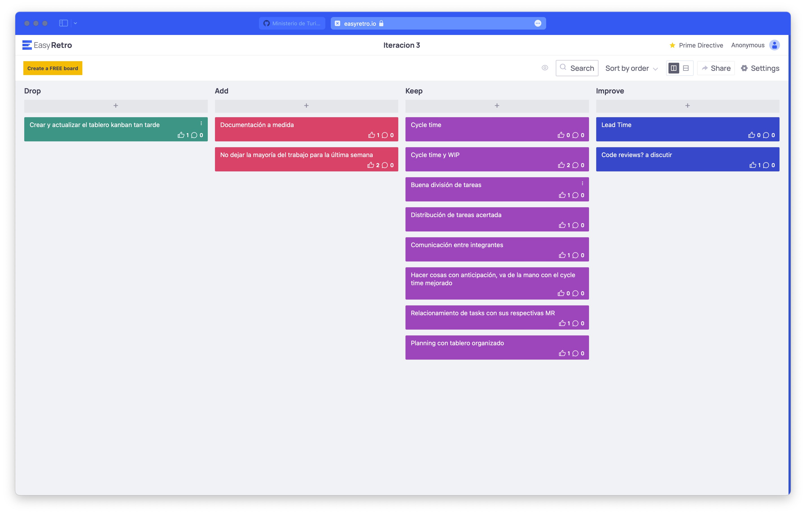

# Documentación Retrospectiva Iteración 3

Retrospectiva 20-05: https://vimeo.com/716795945

Nuevamente, utilizamos la herramienta easyretro.io, como también se utilizó un tablero DAKI: Drop, Add, Keep y Improve. Luego, ingresamos todas las cards anónimamente, lo cual vemos a continuación:

Una vez que todos terminamos de escribir en las columnas, discutimos cada una de las observaciones agregadas.

Destacamos algunas de las más importantes:

Drop:

- Planificar y crear el tablero kanban temprano.

Add:

- Documentar mientras vamos haciendo, de modo que se mejore esta.
- Empezar a trabajar antes en las tareas

Keep:

- Cycle time, que establemente fue corto.
- WIP también de 1 por persona (mejoró respecto a la iteración anterior).
- Buena división o distribución de tareas.
- Comunicación muy buena entre los integrantes.
- Trabajar con tiempo y anticipación, no precipitadamente.
- Planning con tablero organizado.

Improve:

- Mejorar el lead time.

Fue una iteración que consideramos muy buena y creemos positivo que se hayan identificado los elementos que lo permitieron, como se puede ver en la extensa columna Keep.

A continuación discutimos las métricas correspondientes a las horas de trabajo.

- El cycle time varió según el tamaño de las tareas: hubo tareas que requirieron 5 HS-P, y otras 1 HS-P. En este caso las estimaciones fueron muy acertadas, con poca desviación.
No tuvimos grandes obstáculos o errores inesperados a no ser por algunos errores que fueron rápidamente planteados a nivel de equipo y corregidos con la colaboración de todos.

- En cuanto al WIP, nos propusimos que el WIP sea 4 (1 tarea por persona a la vez). Esto se logró muy acertadamente.

Fue una iteración con muy buena distribución de tareas y de carga, y lo destacamos como el mejor hasta ahora, en donde pudimos incorporar los aprendizajes incorporados anteriormente.

El esfuerzo real y estimado en HS-P de cada tarea se puede ver en las descripciones de las mismas en Github.