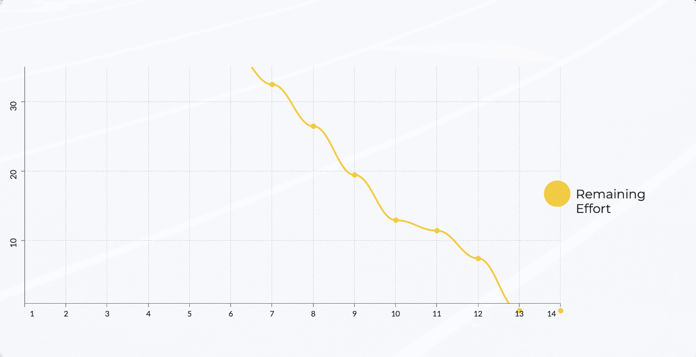

# Documentación Retrospectiva Iteración 3

Retrospectiva 20-05: https://vimeo.com/716795945

Nuevamente, utilizamos la herramienta easyretro.io, como también se utilizó un tablero DAKI: Drop, Add, Keep y Improve. Luego, ingresamos todas las cards anónimamente, lo cual vemos a continuación:

Una vez que todos terminamos de escribir en las columnas, discutimos cada una de las observaciones agregadas.

**Destacamos algunas de las más importantes:**

Drop:

- Planificar y crear el tablero kanban más temprano.

Add:

- Documentar mientras vamos haciendo, de modo que se mejore la documentación en general.
- Empezar a trabajar antes en las tareas.

Keep:

- Cycle time, que se mantuvo de forma estable y fue corto, haciendo que el burndown sea constante.
- WIP también de 1 por persona (mejoró respecto a la iteración anterior en que habíamos tenido períodos con WIP 2).
- Buena división/distribución de tareas.
- Comunicación muy buena entre los integrantes.
- Trabajar con tiempo y anticipación, no precipitadamente.
- Planning con tablero organizado.

Improve:

- Mejorar el lead time. Seguimos dejando tareas como la documentación que se realizan al final, empeorando el lead time del equipo en general.

Fue una iteración que consideramos muy buena (la mejor hasta el momento - en nuestra opinión) y destacamos como positivo en esta retrospectiva el hecho de que la columna Keep predomina (si vemos la imagen, lo que más se ve es color Violeta de **Keep**). Fue una extensa columna.

A continuación discutimos las métricas correspondientes a las horas de trabajo.

- El cycle time varió según el tamaño de las tareas: hubo tareas que requirieron 5 HS-P, y otras 1 HS-P. En este caso las estimaciones fueron muy acertadas, con poca desviación.
No tuvimos grandes obstáculos o errores inesperados a no ser por algunos errores que fueron rápidamente planteados a nivel de equipo y corregidos con la colaboración de todos.

- En cuanto al WIP, nos propusimos que el WIP sea 4 (1 tarea por persona a la vez). Esto se logró muy acertadamente.

Fue una iteración con muy buena distribución de tareas y de carga, y lo destacamos como el mejor hasta ahora, en donde pudimos incorporar los aprendizajes incorporados anteriormente.

El esfuerzo real y estimado en HS-P de cada tarea se puede ver en las descripciones de las mismas en Github.

A continuación presentamos una **burndown chart** de la iteración, que con el esfuerzo real que fuimos "quemando" día a día, en base a los movimientos de las tarjetas en el tablero de Github. 

Tal como se habló en la review, podemos observar que fue una iteración que, si bien el planning se realizó un poco tarde (día 6), una vez que el trabajo comenzó el ritmo de este fue constante. La gráfica se alinea, de forma casi perfecta, a una recta constante.