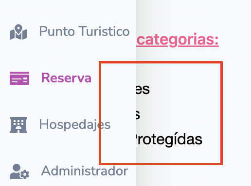

## Incumplimiento de requerimientos

---

**Falta modificación de capacidad de un hospedaje**

En la letra dice que un administrador debería poder `Modificar la capacidad actual de un hospedaje.` pero no se permite realizar dicha acción, solamente se puede modificar la disponibilidad de los mismos.
 

Severidad: alta.

---

**Falta reportes tipo B**

No se ve implementado ni representado el requerimiento de reportes de tipo B, solo el de tipo A.

Severidad: alta.

---

## Testing exploratorio: bugs

---

**Error de fechas en reserva de hospedajes**

Cuando buscamos un hospedaje en un punto turístico e ingresamos un rango de fechas para la reserva, estas fechas son posteriormente modificadas durante el *checkout*:

Y luego:

También sucede que si seleccionamos la fecha de hoy se nos presenta un error incorrecto diciendo que no se pueden hacer reservas para días anterior al actual, cuando estamos seleccionando el actual:

Severidad: alta.

---

**Funcionalidad de importadores**

La funcionalidad de importadores de puntos turísticos y hospedajes es incorrecta.

Primero que nada, pide un "código único de esta para verificar el estado de esta": algo que no tiene sentido en el contexto de importación de puntos turísticos. Se entiende que está hablando de una reserva, lo cual no tiene sentido por lo cual el mensaje allí está mal. Además la funcionalidad de ver una reserva no aplica para administradores.

Luego, si ingresamos el tipo de importador que queremos utilizar y una ruta válida a un archivo con datos, tira un error y no logra hacer la importación: 

Severidad: alta.

---

**Intento de modificación de un mismo administrador identifica administrador repetido**

Cuando intentamos modificar solo la contraseña de un administrador, por ejemplo, pero sin variar su email, nos dice que ya hay un administrador con este email presente, que es el que justamente estamos modificando:

Severidad: alta.

---

**Índice no funcional**

Cuando se accede a la sección de 'Hospedajes' de la página, la lista que se despliega contiene un índice que no es funcional:

Severidad: alta.

---

**Momentos de carga**

Como turista, al consultar sobre hospedajes en un punto turístico, en vez de mostrar alguna animación de carga o similar, se muestra un error que no se encontraron hospedajes por algunos segundos, y luego se muestra la lista. Se debería dar feedback al usuario de que se está cargando, dado que la carga es lenta y el usuario piensa que efectivamente no hay hospedajes disponibles, cuando los hay.

Severidad: alta.

---

**Falta un botón de home**

La falta de un botón de home hace díficil la navegación hacia esta pestaña.

Severidad: media.

--- 
**Superposición de la barra lateral frente a elementos que se encuentran cerca de ella**

Cuando nos paramos en un elemento que está cerca de la barra lateral, como por ejemplo el filtrado de puntos turísticos por categorías, se nos abre la barra lateral lo cual dificulta llevar a cabo la acción inicialmente planificada (seleccionar la categoría, en este caso).

Severidad: baja.

---

**Falta de _responsiveness_**

Otro bug generalizado se da en la _responsiveness_ del sistema, cuando se achica el tamaño de la pantalla:

Severidad: media.

---

**Errores visuales de UI**

En la sección Tu opinión, el campo para escribir la Reseña puede ser expandido indefinidamente, hasta resultar demasiado extenso:

Severidad: baja.

---

**Faltas de ortografía**

Repetidas veces a lo largo del frontend observamos faltas de ortografía. En particular, la omisión casi total de los tildes:

Severidad: alta.

---

**Inconsistencia de idioma**

Muchos de los errores se muestran en inglés. Ejemplo:

 
Severidad: media.

---
 
**Cleanup del formulario**

Algo recurrente en el sistema es que al realizar una alta, no se borran los campos de texto, una buena solución sería borrar los campos de texto al momento de hacer una alta.
 
Severidad: baja.

---
 
**Falta de mensajes de éxito**

Al eliminar un hospedaje, no hay feedback de eliminación, puede confundir al usuario, más aún cuando se redirecciona a la página inicial, como se mencionó antes.
 
Severidad: media.

---

 