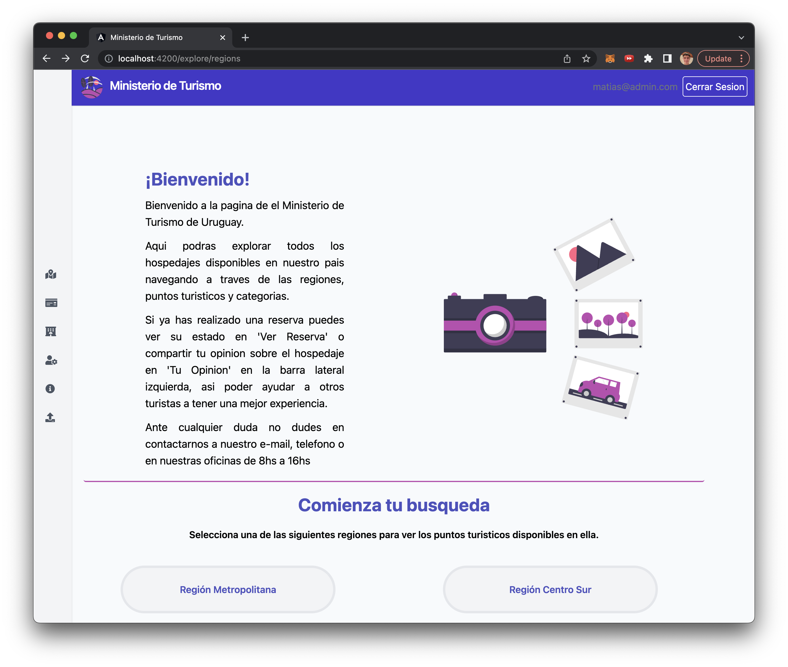

## Bugs

---

Un bug que se puede ver repetidas veces a los largo del Front End de la aplicación son las faltas de ortografía. En particular, la omisión casi total de los tildes:

---

Otro bug generalizado se da en la _responsiveness_ del sistema. Por ejemplo, dado un width pequeño del browser el texto "Aquí puedes crear puntos turísticos!" se descentra:

Otro ejemplo es la sección de Explorar:

---

Cuando se accede a la sección de 'Hospedajes' de la página, la lista que se despliega contiene un índice que no es funcional:

---

La sección de 'Reporte' de la página comienza desplegando ciertos elementos que son reemplazados en seguida por otros. En caso de que esté cargando debería de tener un feedback correspondiente:

---

Cuando se hace hover sobre el navegador de la página en el lado izquierdo, "Punto Turístico" aparece en dos líneas y en seguida se mueve a una, lo cual tiene una efecto de visualización defectuoso:

---

En la sección Explorar, cuando el width del browser en pequeño las opciones de huespedes se superponen:

---

En la sección Tu opinión, el campo para escribir la Reseña puede ser expandido indefinidamente, hasta resultar demasiado extenso:

---

## Bugs Integración

### Bugs para los usuarios de tipo **turista**:

Se observa que funcionan mayoritariamente de manera correcta, sin embargo, hay algunos bugs que se pueden observar:

A la hora de consultar sobre una reserva, le descripción de las mismas esta en ingles, mientras que todo el resto de la aplicación está en espanol:

## 

A su vez, como turista, al consultar sobre hospedajes en un punto turístico, en vez de mostrar alguna animación de carga o similar, se muestra un error que no se encontraron hospedajes por algunos segundos, y luego se muestra la lista. Esto podría desorientar al usuario, sería mejor agregar una animación de carga.

---

### Bugs para los usuarios de tipo **admin**:

---

En la lista de Hospedajes, cuando un admin hace doble click para borrar una línea de la tabla, se redirecciona a la página inicial.

---

Como ocurría anteriormente en otras funcionalidades, el sistema a veces da feedback en inglés y a veces espanol, aqui al crear un nuevo punto de hospedaje e ingresar un numero invalido, se muestra un error en ingles:

 
---
 
Algo recurrente en el sistema es que al realizar una alta, no se borran los campos de texto, una buena solución sería borrar los campos de texto al momento de hacer una alta.
 
---
 
Al eliminar un hospedaje, no hay feedback de eliminación, puede confundir al usuario, más aún cuando se redirecciona a la página inicial, como se mencionó antes.
 
---
 
En la letra dice que un administrador debería poder `Modificar la capacidad actual de un hospedaje.` pero no se permite realizar dicha acción, solamente se puede modificar la disponibilidad de los mismos.
 

