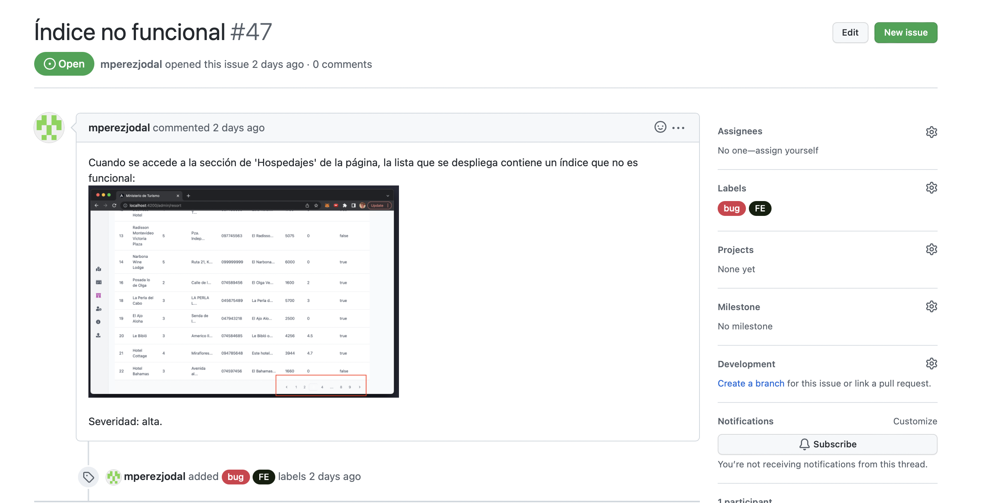

# ProyectoDevOps_Grupo3_IglesiasPerezMolinoloJuan

Integrantes: Marcelo Pérez -227362-, Federico Iglesias -244831-, Andrés Juan -241600-, Matías Molinolo -231323-.

Letra del obligatorio: https://fi365.sharepoint.com/:w:/s/IngSoft_ISA2/EYTQH9GaZQlGoOZ21O9BRJEBAk3wSQY6UeoB2SvIKk4c2g?e=6TDPhl

Link al repositorio: [Repositorio](https://github.com/figlesias221/ProyectoDevOps_Grupo3_IglesiasPerezMolinoloJuan)

## Proceso de ingeniería

El proceso de ingeniería lo podemos encontrar aquí: [Proceso de ingeniería](./Documentos/ProcesoIngenieria.md)

Documentación de las dailies y retrospectivas: [Documentación de avance](./Documentos/DocAvance.md)

## Informe de calidad y deuda técnica

Para ver el informe de calidad y deuda técnica, podemos observar los siguientes enlaces:
- [Introducción al informe de calidad y deuda técnica](./Documentos/IntroduccionInformeCalidad.md)
- [Análisis estático del código del backend](./Documentos/AnalisisEstaticoCodigoBackEnd.md)
- [Análisis estático del código del frontend](./Documentos/AnalisisEstaticoCodigoFrontEnd.md)
- [Testing exploratorio: bugs encontrados](./Documentos/TestingExploratorio.md)

## Proceso: stand-ups y retrospectiva

Se pueden encontrar aquí: [Stand-ups y retrospectivas](./Documentos/DocAvance.md)

## Registro de esfuerzo

Los detalles de registro de esfuerzo por tarea e integrantes se pueden encontrar en la descripción de cada issue en el Board Ministerio de Turismo: Iteración 1, en el repositorio de Github. Ejemplo:

## Issues identificados ingresados en Github

Fueron ingresados todos los issues identificados a Github con su descripción, una foto del bug si corresponde, su severidad (alta, media o baja) y labels. Esto se puede ver en la sección Issues del repositorio. Ejemplo:

