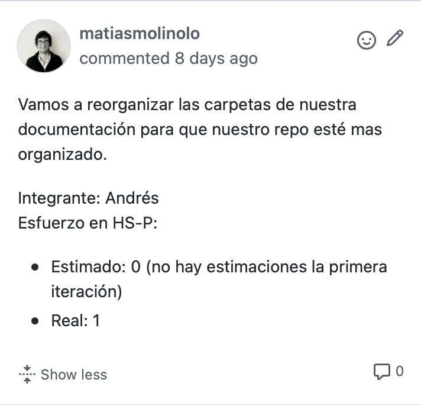
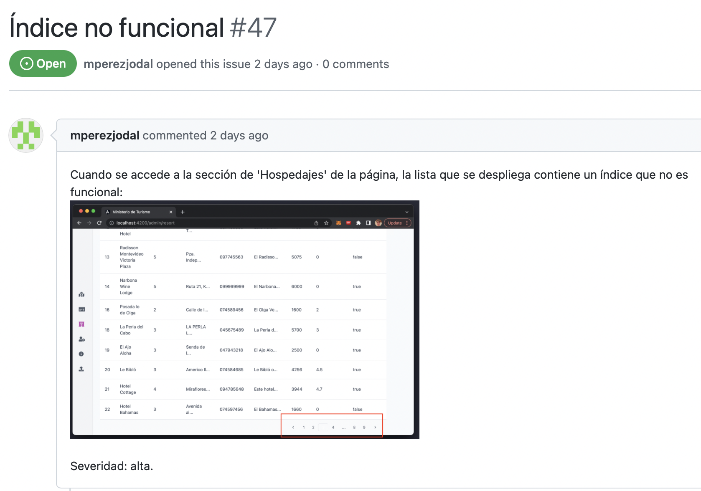

# ProyectoDevOps_Grupo3_IglesiasPerezMolinoloJuan

Integrantes: Marcelo Pérez -227362-, Federico Iglesias -244831-, Andrés Juan -241600-, Matías Molinolo -231323-.

Letra del obligatorio: https://fi365.sharepoint.com/:w:/s/IngSoft_ISA2/EYTQH9GaZQlGoOZ21O9BRJEBAk3wSQY6UeoB2SvIKk4c2g?e=6TDPhl

Link al repositorio: [Repositorio](https://github.com/figlesias221/ProyectoDevOps_Grupo3_IglesiasPerezMolinoloJuan)

# Iteración 1

## Proceso de ingeniería

El proceso de ingeniería lo podemos encontrar aquí: [Proceso de ingeniería](./Documentos/ProcesoIngenieria.md)

## Informe de calidad y deuda técnica

Para ver el informe de calidad y deuda técnica, podemos observar los siguientes enlaces:
- [Introducción al informe de calidad y deuda técnica](./Documentos/IntroduccionInformeCalidad.md)
- [Análisis estático del código del backend](./Documentos/AnalisisEstaticoCodigoBackEnd.md)
- [Análisis estático del código del frontend](./Documentos/AnalisisEstaticoCodigoFrontEnd.md)
- [Testing exploratorio: bugs encontrados](./Documentos/TestingExploratorio.md)

## Proceso: stand-ups y retrospectiva

Se pueden encontrar aquí: [Stand-ups y retrospectivas](./Documentos/Retrospectiva1.md)

#### Registro de esfuerzo

Los detalles de registro de esfuerzo por tarea e integrantes se pueden encontrar en la descripción de cada issue en el Board Ministerio de Turismo: Iteración 1, en el repositorio de Github. Ejemplo:

#### Issues identificados ingresados en Github

Fueron ingresados todos los issues identificados a Github con su descripción, una foto del bug si corresponde, su severidad (alta, media o baja) y labels. Esto se puede ver en la sección Issues del repositorio. Ejemplo:

# Iteración 2

A continuación se pueden encontrar las justificaciones de los bugs priorizados en esta iteración, las guiás de desarollo/mantenimiento del tablero usando BDD y la configuración/mantenimiento del pipeline y su vínculo con el tablero.
- [Justificaciones y guías iteración 2](./Documentos/Iteracion2.md)

En cada tarjeta del tablero en Github, se pueden encontrar los esfuerzos estimados y reales en HS-P por integrante y por tarea, así como una descripción de la task/bug si corresponde, y escenarios escritos en vocabulario GHERKIN para las user stories, a partir de los cuales se realizó la review por cada product owner.

Las validaciones cruzadas fueron las siguientes:
- PO baja punto de carga: Andrés (realizado por Matías)
- PO alta punto de carga: Federico (realizado por Marcelo)
- PO bug de fechas en reserva de hospedajes: Marcelo (realizado por Federico)
- PO bug de cálculo de precios para reserva de hospedajes: Matías (realizado por Andrés)

## Proceso: 

- [Retrospectiva](./Documentos/Retrospectiva2.md)
- [Review del bug de errores de lógica en el cálculo de precio](https://vimeo.com/712639179)
- [Review de la funcionalidad de alta de puntos de carga](https://vimeo.com/712193656)
- [Review del bug de error de fechas en reservas de hospedades](https://vimeo.com/712194551)
- [Review de la funcionalidad de baja de puntos de carga](https://vimeo.com/712637922)

